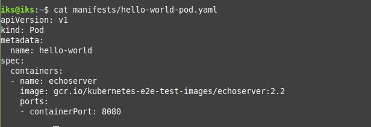
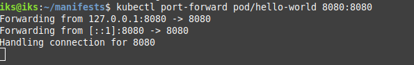
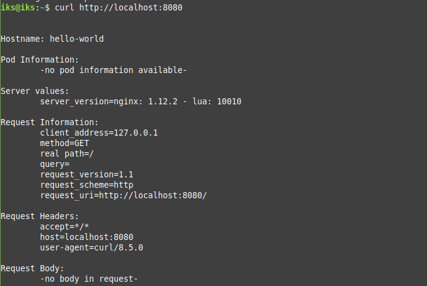
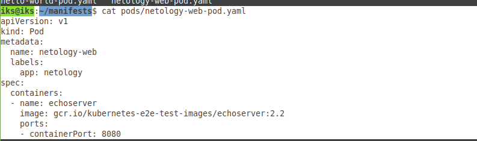
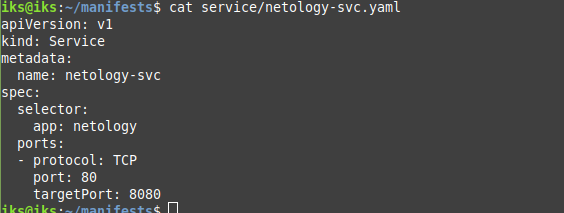
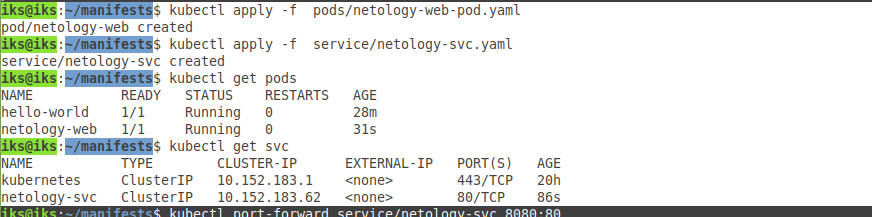
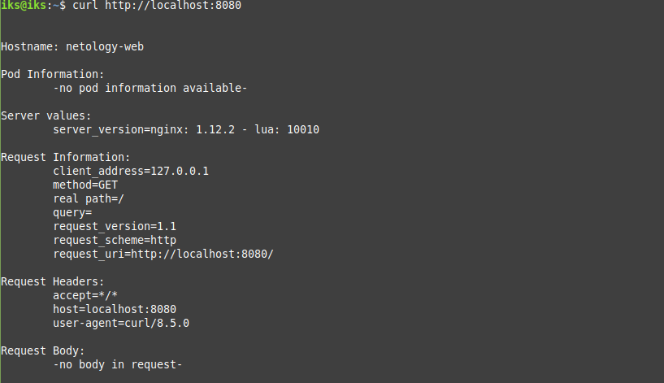

# Домашнее задание к занятию «Базовые объекты K8S»

## Задание 1  
1.создание манифеста
  
2. запуск pod'a
  
  
3. проверка через curl
  

---

## Задание 2  
1. создание манифестов для pod и svc
  
  
2. запуск pod и svc

3. проверка через curl  
